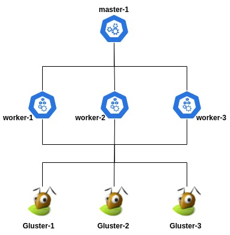
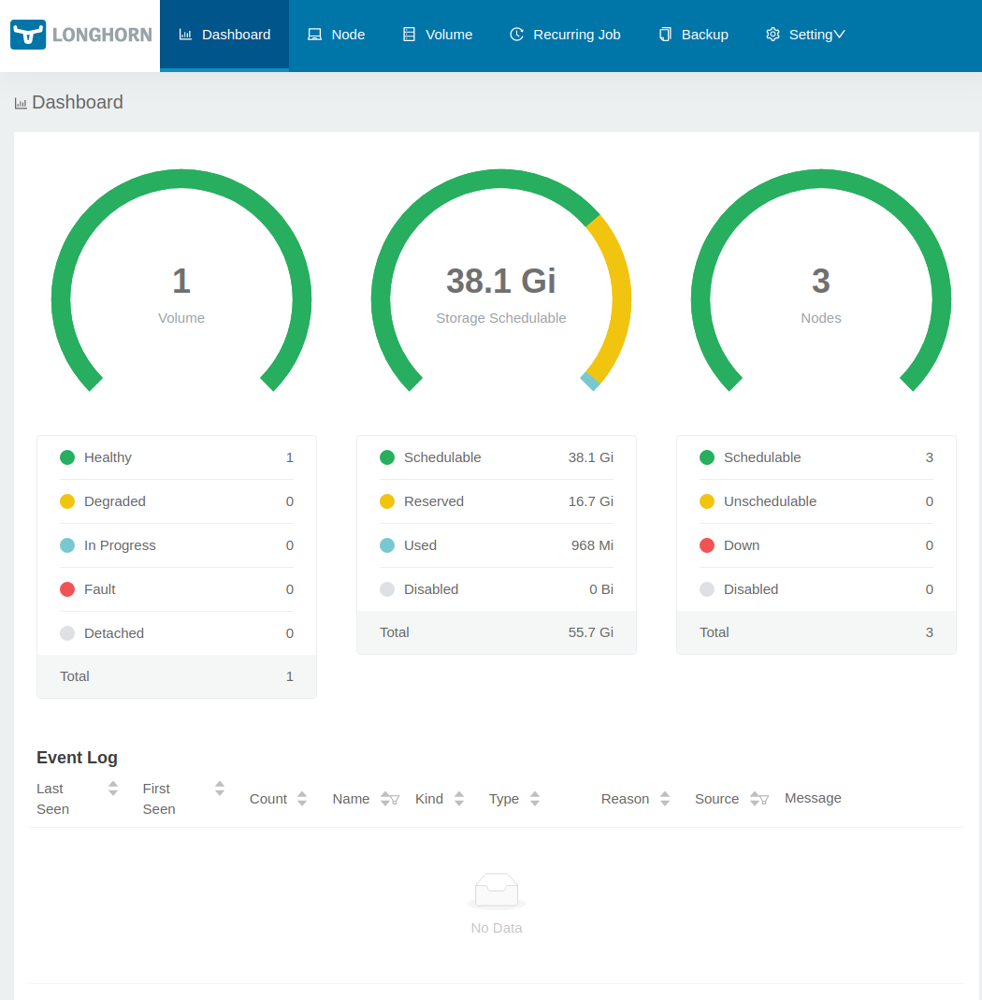
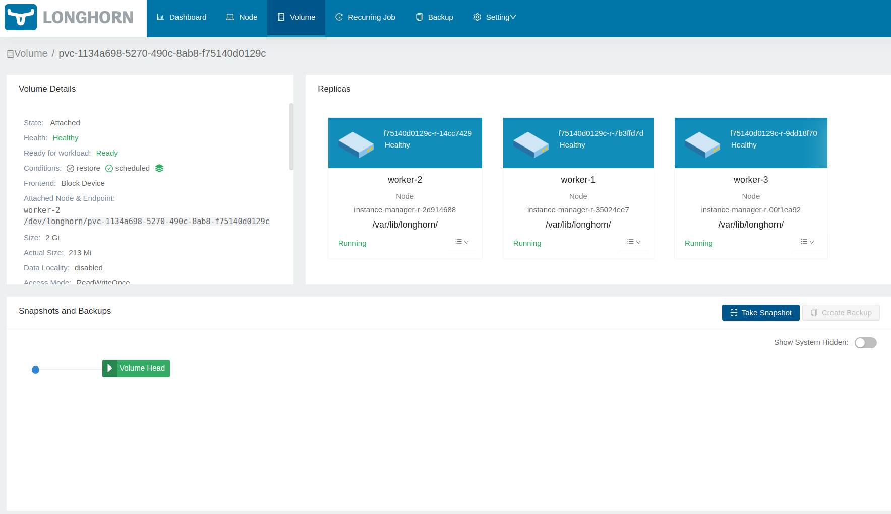

# K8S Cluster VMs

It is expected to run the command `vagrant up --no-parallel`

This repository is designed to create a Kubernetes cluster environment for test proposals only, under VMs provisioned by [Vagrant](https://www.vagrantup.com/).

**Summary:**
- [K8S Cluster VMs](#k8s-cluster-vms)
- [Pre-requirements](#pre-requirements)
  - [System Requirements](#system-requirements)
- [Deploy solution](#deploy-solution)
- [Design](#design)
- [Network](#network)
- [Disks:](#disks)
- [Features](#features)
  - [Master](#master)
  - [Workers](#workers)
  - [Gluster](#gluster)
  - [Longhorn](#longhorn)
- [Examples](#examples)
  - [Gluster](#gluster-1)
  - [Longhorn](#longhorn-1)

# Pre-requirements

The solution is expected to deploy virtual machines by [Vagrant](https://www.vagrantup.com/), therefore, it is necessary to prepare your environment, according:

## System Requirements

The **memory** and **cpu** resources for each virtual machine, is specified on [Vagrantfile](Vagrantfile), on variables `CPU` and `MEMORY`, that it is recommended, according:

- `CPU`: 2
- `MEMORY`: 2048

***The memory resources are allocated dynamically, according utilization of each VM.***

# Deploy solution

In order to deploy the solution, it is only necessary to run the command `vagrant up --no-parallel`, according
```
$ vagrant up --no-parallel
Bringing machine 'master-1' up with 'libvirt' provider...
Bringing machine 'worker-1' up with 'libvirt' provider...
Bringing machine 'worker-2' up with 'libvirt' provider...
Bringing machine 'worker-3' up with 'libvirt' provider...
Bringing machine 'gluster-1' up with 'libvirt' provider...
Bringing machine 'gluster-2' up with 'libvirt' provider...
Bringing machine 'gluster-3' up with 'libvirt' provider..
```

It is necessary to specify the option [--no-parallel](https://www.vagrantup.com/docs/cli/up),because the environment has to be build in the order specified on [Vagrantfile](Vagrantfile), therefore, the default settings to deploy VMs in parallel, could generate issues.

***The deployment usually takes at around 15 minutes, however, could change according your machine.***

# Design

The full design of this soluition expect to create the VMs below:

```
virsh # list
 Id   Name                        State
-------------------------------------------
 1    k8s_cluster_vms_master-1    running
 2    k8s_cluster_vms_worker-1    running
 3    k8s_cluster_vms_worker-2    running
 4    k8s_cluster_vms_worker-3    running
 5    k8s_cluster_vms_gluster-1   running
 6    k8s_cluster_vms_gluster-2   running
 7    k8s_cluster_vms_gluster-3   running
```

You can see more details about this solution on this diagram:



# Network

During the deployment of those VMS, it is expected to associate those resources to a specific network, and IP range, with fixed IP addresses, that is declared on [Vagrantfile](Vagrantfile), according variables:

- `NETWORK`: "private_network"
- `SUBNET`: "192.168.50"

Each of the features contains also a variable to declare the range of fixed IPs on subnets:
- `GLUSTER_RANGE`: "30"
- `MASTER_RANGE`: "10"
- `WORKER_RANGE`: "20"

Considering the default values above, it is expected each of VMs to be be associated to the fixed IPs:

- `master-1`: 192.168.50.11
- `worker-1`: 192.168.50.21
- `worker-2`: 192.168.50.22
- `worker-3`: 192.168.50.23
- `gluster-1`: 191.168.50.31
- `gluster-2`: 191.168.50.32
- `gluster-3`: 191.168.50.33


# Disks:

It is expected to deploy an additional disk on each node, according the variables below declared on [Vagrantfile](Vagrantfile):
- `DISK_DEVICE`: The name of device to be associated on VM
- `DISK_FS`: The filesystem to deploy on additional disk
- `DISK_NAME`: Name of device to setup the LVM volume on this disk
- `DISK_SIZE`: The size of the disk to be deployed, the standard value is `20GB`

# Features

After the deployment of VMs, it is expected to run the [bootstrap](bootstrap/) actions via [Ansible](https://www.ansible.com/), and then deploy required features on each node, according:

## Master

Those actions are required to run on `master` nodes only, according [bootstrap/master.yml](bootstrap/master.yml):
- [install_prereqs](bootstrap/roles/master/tasks/install_prereqs.yml): Install required packages for `control-plane`.
- [install_cri](bootstrap/roles/master_and_workers/tasks/install_cri.yml): Install the [Kubernetes CRI](https://kubernetes.io/blog/2016/12/container-runtime-interface-cri-in-kubernetes/), that is [Docker](https://www.docker.com/), at the moment.
- [install_kube_packages](bootstrap/roles/master_and_workers/tasks/install_kube_packages.yml): Install properly packages for `control-plane` and `worker` nodes.
- [master_join](bootstrap/roles/master/tasks/master_join.yml): Initialize the cluster, besides install [calico](https://www.tigera.io/project-calico/) as [CNI](https://kubernetes.io/docs/concepts/extend-kubernetes/compute-storage-net/network-plugins/). This action also copy `admin.conf` file to `~/.kube/config`, in order to provide direct access to the Kubernetes cluster.

## Workers

Those actions are required to deploy `worker` nodes, according [bootstrap/worker.yml](bootstrap/worker.yml):
- [install_cri](bootstrap/roles/master_and_workers/tasks/install_cri.yml): Install the [Kubernetes CRI](https://kubernetes.io/blog/2016/12/container-runtime-interface-cri-in-kubernetes/), that is [Docker](https://www.docker.com/), at the moment.
- [install_kube_packages](bootstrap/roles/master_and_workers/tasks/install_kube_packages.yml): Install properly packages for `control-plane` and `worker` nodes. 
- [worker_join](bootstrap/token_worker_join): This action is designed to join the `worker` node on Kubernetes cluster, in order to complete this step, the file `bootstrap/token_worker_join` it is copied inside the node to complete the operation, that was generated by previously task [master_join.yml](bootstrap/roles/master/tasks/master_join.yml).
  

## Gluster

**The [GlusterFS](https://www.gluster.org/) is deployed only if the variable `GLUSTER_DEPLOY` is set with the value `yes` on [Vagrantfile](Vagrantfile).**

This role is expected to be deployed only on specific nodes to deploy host this solution, according prefix `gluster-x`, according:
- [gluster/install](bootstrap/roles/gluster/tasks/install.yml): Install properly packages for GlusterFS.
- [gluster/add_node_peers](bootstrap/roles/gluster/tasks/add_node_peers.yml): This task is expected to run only on the last node, and then associate all nodes in a cluster.
- [lvm/add_lvm_volumes](bootstrap/roles/lvm/tasks/add_lvm_volumes.yml): Create properly LVM volumes to associate gluster volumes
- [gluster/add_volumes](bootstrap/roles/gluster/tasks/add_volumes.yml): Create a few volumes, in order to be ease associate on [examples/](examples/)

The gluster nodes are expected to be deployed with the `LVM` volume, according:
```
$ lsblk
NAME             MAJ:MIN RM   SIZE RO TYPE MOUNTPOINT
vda              253:0    0   128G  0 disk 
|-vda1           253:1    0   487M  0 part /boot
|-vda2           253:2    0   1.9G  0 part [SWAP]
`-vda3           253:3    0 125.6G  0 part /
vdb              253:16   0    20G  0 disk 
`-data-data--vdb 252:0    0    19G  0 lvm  /data
```

You can also see the `peers`, according:
```
$ sudo gluster pool list
UUID                                    Hostname        State
6aaf0f3e-58fc-470f-86a9-66524fcece6f    192.168.50.33   Connected 
df666838-99f1-4fac-a294-0713cd9a9b20    192.168.50.32   Connected 
b867614d-5ed0-4c81-a92a-a4df67d4f6a4    localhost       Connected 
```

Also, we can see the example volumes:

```
$ sudo gluster volume list
pv01
pv02
pv03
```

As you can see, the volumes details, they are replicated among the three nodes:
```
$ sudo gluster volume status
Status of volume: pv01
Gluster process                             TCP Port  RDMA Port  Online  Pid
------------------------------------------------------------------------------
Brick 192.168.50.31:/data/pv01              49152     0          Y       1605 
Brick 192.168.50.32:/data/pv01              49152     0          Y       1224 
Brick 192.168.50.33:/data/pv01              49152     0          Y       1163 
Self-heal Daemon on localhost               N/A       N/A        Y       1638 
Self-heal Daemon on 192.168.50.32           N/A       N/A        Y       1304 
Self-heal Daemon on 192.168.50.33           N/A       N/A        Y       1298 
 
Task Status of Volume pv01
------------------------------------------------------------------------------
There are no active volume tasks
 
Status of volume: pv02
Gluster process                             TCP Port  RDMA Port  Online  Pid
------------------------------------------------------------------------------
Brick 192.168.50.31:/data/pv02              49153     0          Y       1616 
Brick 192.168.50.32:/data/pv02              49153     0          Y       1271 
Brick 192.168.50.33:/data/pv02              49153     0          Y       1269 
Self-heal Daemon on localhost               N/A       N/A        Y       1638 
Self-heal Daemon on 192.168.50.32           N/A       N/A        Y       1304 
Self-heal Daemon on 192.168.50.33           N/A       N/A        Y       1298 
 
Task Status of Volume pv02
------------------------------------------------------------------------------
There are no active volume tasks
 
Status of volume: pv03
Gluster process                             TCP Port  RDMA Port  Online  Pid
------------------------------------------------------------------------------
Brick 192.168.50.31:/data/pv03              49154     0          Y       1627 
Brick 192.168.50.32:/data/pv03              49154     0          Y       1285 
Brick 192.168.50.33:/data/pv03              49154     0          Y       1285 
Self-heal Daemon on localhost               N/A       N/A        Y       1638 
Self-heal Daemon on 192.168.50.32           N/A       N/A        Y       1304 
Self-heal Daemon on 192.168.50.33           N/A       N/A        Y       1298 
 
Task Status of Volume pv03
------------------------------------------------------------------------------
There are no active volume tasks
```


## Longhorn

**The [Longhorn](https://longhorn.io/) solution is expected to be deployed on `worker` nodes, only if the variables `LONGHORN_DEPLOY` is set with the value `yes`.**

- [lvm/add_lvm_volumes](bootstrap/roles/lvm/tasks/add_lvm_volumes.yml): Create properly LVM volumes to associate gluster volumes
- [longhorn/install](bootstrap/roles/longhorn/tasks/install.yml): Install the required packages on `worker` nodes to Longhorn, besides install on Kubernetes, [Quick Install](https://longhorn.io/docs/1.2.2/deploy/install/) documentation page.

The [Longhorn UI](https://longhorn.io/docs/1.2.2/deploy/accessing-the-ui/) is exposed via `NodePort 30007`, according: 
 

# Examples

The [examples/](examples/) directory is designed to provide a few examples that you can ease apply and then show some functionalities of this environment:

## Gluster

This example expect to deploy a MySQL database that uses a PV connected on GlusterFS cluster, according:

```
$ k -n examples-gluster get all
NAME                         READY   STATUS    RESTARTS   AGE
pod/mysql-84559bcc56-fftcr   1/1     Running   0          11s

NAME            TYPE        CLUSTER-IP   EXTERNAL-IP   PORT(S)    AGE
service/mysql   ClusterIP   None         <none>        3306/TCP   57m

NAME                    READY   UP-TO-DATE   AVAILABLE   AGE
deployment.apps/mysql   1/1     1            1           57m

NAME                               DESIRED   CURRENT   READY   AGE
replicaset.apps/mysql-75c8d455b8   0         0         0       57m
replicaset.apps/mysql-84559bcc56   1         1         1       11s

$ k -n examples-gluster get pv mysql-pv
NAME       CAPACITY   ACCESS MODES   RECLAIM POLICY   STATUS   CLAIM                        STORAGECLASS   REASON   AGE
mysql-pv   1Gi        RWO            Retain           Bound    examples-gluster/mysql-pvc                           58m
```

You can apply this example just running the command:
```
$ k apply -f examples/longhorn/mysql_deployment.yml 
namespace/examples-longhorn unchanged
service/mysql unchanged
persistentvolumeclaim/mysql-pvc unchanged
deployment.apps/mysql unchanged
```


## Longhorn

This example expect to deploy a MYSQL database that uses a Persistent Volume provisioned by Longhorn, according:

```
$ k -n examples-longhorn get all
NAME                        READY   STATUS    RESTARTS   AGE
pod/mysql-5dddd8cd5-jhhtp   1/1     Running   0          2m37s

NAME            TYPE        CLUSTER-IP   EXTERNAL-IP   PORT(S)    AGE
service/mysql   ClusterIP   None         <none>        3306/TCP   57m

NAME                    READY   UP-TO-DATE   AVAILABLE   AGE
deployment.apps/mysql   1/1     1            1           57m

NAME                               DESIRED   CURRENT   READY   AGE
replicaset.apps/mysql-5dddd8cd5    1         1         1       2m37s
replicaset.apps/mysql-75c8d455b8   0         0         0       57m
```



You can apply this example just running the command:
```
$ k apply -f examples/gluster/mysql_deployment.yml 
namespace/examples-gluster unchanged
endpoints/glusterfs-cluster configured
service/glusterfs-cluster unchanged
persistentvolume/mysql-pv configured
persistentvolumeclaim/mysql-pvc unchanged
service/mysql unchanged
deployment.apps/mysql unchanged
emerson@k8s_cluster_vms$ 
```